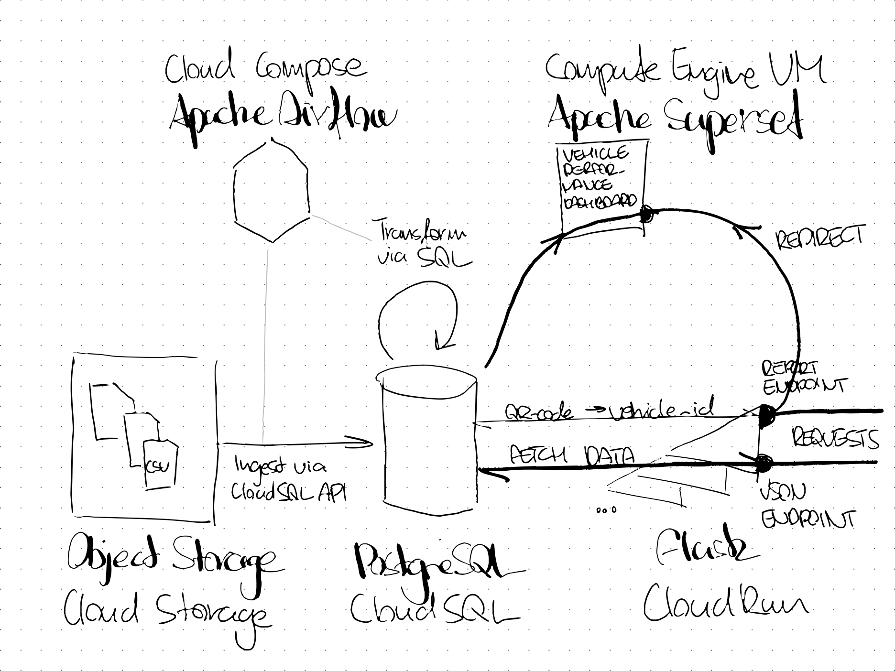
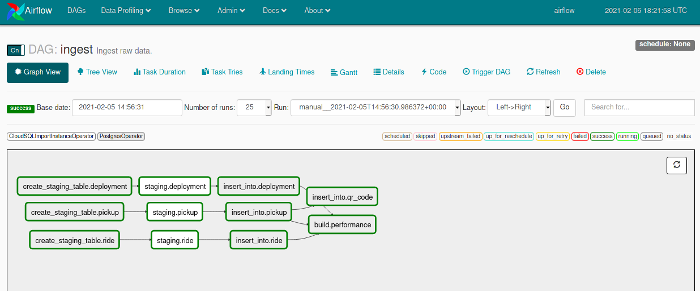
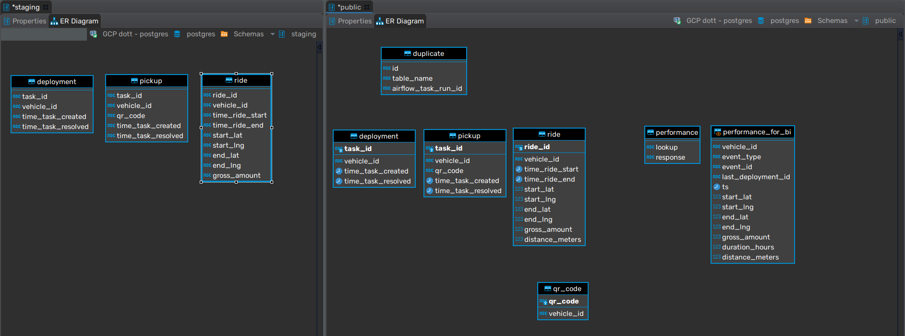
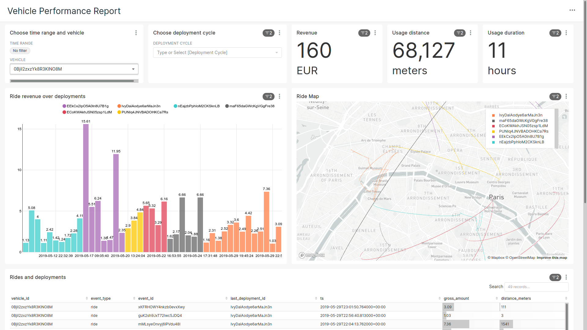

# **Senior Data Engineer at Dott** - Assignment

- [**Senior Data Engineer at Dott** - Assignment](#senior-data-engineer-at-dott---assignment)
- [Approach](#approach)
- [Solution](#solution)
  - [Data Storage](#data-storage)
    - [Choice of database](#choice-of-database)
    - [Storing csv](#storing-csv)
  - [ETL](#etl)
    - [Ingest](#ingest)
      - [Locking at staging](#locking-at-staging)
      - [Using constraints for data validity](#using-constraints-for-data-validity)
      - [Logging duplicates](#logging-duplicates)
    - [Data Model](#data-model)
      - [Presentation tables](#presentation-tables)
  - [Endpoints, Flask-application](#endpoints-flask-application)
    - [Cloud Run](#cloud-run)
    - [Flask](#flask)
  - [Vehicle Performance Report on Apache Superset](#vehicle-performance-report-on-apache-superset)
    - [Not a production deployment](#not-a-production-deployment)
  - [Stress test](#stress-test)
  - [Unit tests and testing](#unit-tests-and-testing)

# Approach
First I tried to better imagine the use case: Building an endpoint to serve insights on vehicle performance. However, I was unsure if this endpoint should serve other programs or humans. Building an endpoint that responds with a pre-determined piece of metrics was resembling to an API for me. Especially since the assignment hints at QR-codes, I thought of an endpoint that could be called from a handheld device, when a technician scans the code of a vehicle.

However, the assignment also says the endpoint "should render or redirect to your vehicle performance metrics", which lead me to think that the end user should see visualized data on vehicle performance.

I decided to treat these as two separate use cases and build two endpoints:
- One that responds with data as specified in this assignment, in json format and is optimized for fast responses,
- And one that redirects to a vehicle performance dashboard optimized for human consumption.

I started the project with exploration, to get familiar with the data before building anything.  
This basic exploration can be found in the `eda/`-folder in multiple formats.

# Solution

## Data Storage
### Choice of database
Depending on the circumstances, different kinds of databases could be used. If our data sources are mostly "unstructured" such as these csv-files, Google Dataproc could be a good solution. If we work more with data of a relational origin, Bigquery would make a lot of sense as well. This exercise can even be thought of as a streaming problem, where ride, deploy and pickup events arrive in real-time.

All in all, I could keep speculating furter about the bigger picture, but all the above-mentioned solutions felt to be overkill for 15Mb worth of csv in the end. The overhead of large distributed systems can even make them slower for small data sizes such as these. For this reason, I decided to go with a simple ordinary PostgreSQL database on CloudSQL.

### Storing csv
I decided to keep the csv-files in Cloud Storage, thinking along a scenario where these files could get periodically updated in a batch-fashion.

## ETL
For ETL, I chose the managed Airflow of Cloud Composer.

For simplicity, I organized all transformations into one DAG. In a real-world scenario, with multiple dependencies, and other downstream uses of this data source, I would suggest to split the DAG up into individual upstream and a downstream DAGs to separate concerns. DAGs could be triggered with a Sensor, or  run on a simple schedules.

### Ingest
#### Locking at staging
The first step of ETL is to trigger ingest using a `CloudSQLImportInstanceOperator`. Only one import of this kind can run at a time per CloudSQL instance, so I implemented a locking mechanism using a task pool of 1 slot. Since the three tables are otherwise transformed in parallel, locking is necessary here to avoid errors from the two tasks that loose the race to make the API-call first.

#### Using constraints for data validity
A benefit of using a traditional RDMS is having the ability to enforce constraints. All tables have primary keys and `NOT NULL`-constraints for columns that had no missing values at data exploration. This also takes care of the depuplication requirement, using an `ON CONFLICT DO NOTING`-option on the INSERT-clauses from staging to validated tables.

#### Logging duplicates
To satisfy the duplicate logging requirement, I check for duplicates between the staging and production tables, and append the `task_id` / `ride_id` of these to a dedicated `duplicate`-table for any furter processing. It contains the ID of the offending row, the name of the table for which the offence occured and an Airflow task ID, via Jinja-templating.

### Data Model

Since the source data is already organized around entities, I didn't do any major remodeling of the data.

I create one new table around vehicles to be able to quickly translate between `qr_code` and `vehicle_id` for requests coming through the reporting endpoint. This is indexed on `qr_code` for fast lookups.

The duplicates table is solely added for the requirement in the assignment.

#### Presentation tables
A table and a view are built to serve each endpoint:
- The `performance`-table is designed to enable fast responses on the json-endpoint. It has all the required data pre-calculated and json-formatted for each `vehicle_id` and `qr_code`. This results in data duplication, but in turn it allows for a simpler logic in the Flask-application, by not having to distinguish QR-codes from vehicle IDs. All that's needed is to do a lookup on the index using the vehicle ID or QR-code, and forward the pre-computed and formatted response field to the client, setting the response header to `application/json`.
- The `performance_for_bi`-table is a view, and is designed to feed the Superset-dashboard with the necessary data. This one could actually be optimized better, in two ways: 1. Using subqueries, so that the database engine can push down WHERE-clauses from Superset *(the dashboard has a mandatory filter of 1 vehicle ID at all times)*. 2. By materializing the view / updating a table periodically.  
*I didn't do this for a lack of time. I came up with the idea of two endpoints while doing the assignment, and decided to focus on other tasks as the dashboard's loading time was already acceptable.*

## Endpoints, Flask-application
### Cloud Run
I chose Cloud Run for handling requests. Cloud Functions could have been even more lightweight, but they can only have one connection to a database at a time, which I though is a downside if the endpoint has to stand up to real load. App Engine, Compute Engine VMs or Kubernetes clusters could have worked too, but they were too heavy and complex for the use case. Cloud Run seems like the perfect tool for this job, with autoscaling and easy deployment out of the box.

### Flask
The Flask-application handling requests is listening on two endpoints.

1. **For machines. Fast and responding in json:**  
[`https://app-utzqrtdciq-ez.a.run.app/api/v1/vehicles/<vehicle_id_or_QR_code>`](https://app-utzqrtdciq-ez.a.run.app/api/v1/vehicles/0Hwjp4UNBgxHVufdzvV9)  
This endpoint takes care of input validation for length (20 for vehicle ID and 6 for QR-codes), handles these errors, just like vehicles that are not found in the database.
Exceptions are also returned jsonified to make programmatic processing of the response easier.  

2. **For people. Slower, redirecting to a report:**  
[`https://app-utzqrtdciq-ez.a.run.app/report/v1/vehicles/<vehicle_id_or_QR_code>`](https://app-utzqrtdciq-ez.a.run.app/report/v1/vehicles/0BjiI2zxzYk8R3KlNO8M)  
This endpoint also takes care of input validation, QR-code to vehicle ID conversion, and checks if there is available data on the requested vehicle.
If all the above checks out, it redirects the client to a Superset-dashboard pre-filtered for the given vehicle. Any errors are returned human-readable.

## Vehicle Performance Report on Apache Superset

I chose Superset for data visualization because it provides a visually pleasing dashboard solution and a lot a of flexibility in configuration, all free and open source.  
I built a simple report with basic metrics on vehicle usage and profitability, with the ability to see historical performance over an adjustable time window, plus a map to visualize rides. This deviates from the requirements set out in the assignment a little bit, but I believe that having more context could be useful to better judge the profitability of a vehicle over time. If needed, the filters on vehicle, time window and deployment cycles allow for displaying the same data that the json endpoint is returning.  
*The dashboard is public, so no need to authenticate after the Flask redirect.*  

### Not a production deployment
Superset is currently developed as a Compute Engine VM, running in development mode. It's only purpose is to illustrate the solution.  
In a production setup, I would recommend using either a Kubernetes cluster or going serverless with a combination of App Engine (webserver and worker nodes), Cloud Memorystore (Redis cache) and Cloud SQL (Metadata DB).

## Stress test
I stress tested the json-endpoint with the Locust python package, see the `load_test/`-folder.  
The test lasted 7 minutes and loaded the endpoint with 173 requests per second on average.  
I loaded the endpoint with valid, missing and invalid vehicle IDs in 7:2:1 ratio to simulate all scenarios.  
Thanks to the autoscaling of Cloud Run, precomputing responses in the database and having very lean logic in Flask, most requests returned in around 40ms. There were some slowdowns, due to autoscaling I assume, but the RPS never fell below 111. Requirement was *5000/60=83.3*.

## Unit tests and testing
Due to running out of time, I couldn't reach full coverage with the unit tests. Most SQL-scripts are unit tested however. Tests can be found in `test/`.  
In a production scenario, I would suggest to put in place pipeline tests using [great_expectations](https://greatexpectations.io/). This would cover a lot potential issues by easily allowing us to test the statistical properties of the data, with relatively low effort.
